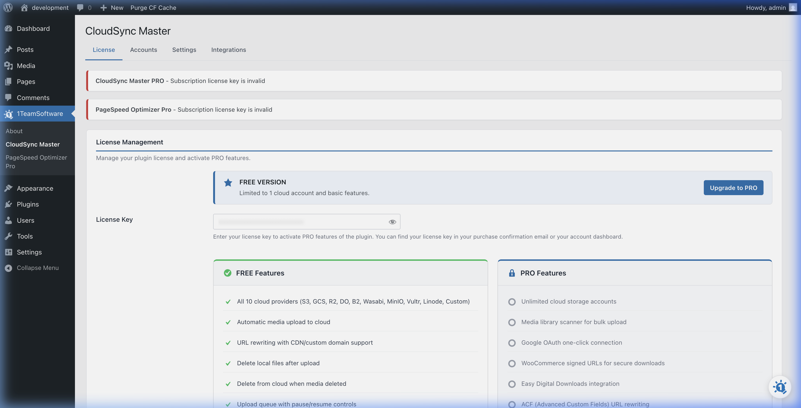

# Installation

Getting WP CloudSync Master installed takes a few minutes. Follow the steps below for your version.

## Installing the Free Version

1. Log in to your WordPress Admin dashboard.
2. In the left-hand menu, navigate to **Plugins > Add New Plugin**.
3. In the search bar at the top right, type **"CloudSync Master"**.
4. Locate the plugin (authored by OneTeamSoftware) and click **Install Now**.
5. Once the installation completes, click **Activate**.

You will now see a new **CloudSync Master** menu item in your WordPress admin sidebar.

## Installing the PRO Version

If you purchased WP CloudSync Master PRO, you will receive a `.zip` file containing the premium plugin.

1. Download the `wp-cloudsync-master-pro.zip` file from your [1TeamSoftware account](https://1teamsoftware.com/my-account/) after purchase.
2. Log in to your WordPress Admin dashboard.
3. Navigate to **Plugins > Add New Plugin**.
4. Click the **Upload Plugin** button at the top of the screen.

5. Click **Choose File** and select the `.zip` file you downloaded.
6. Click **Install Now**.
7. Once installed, click **Activate Plugin**.

### Entering Your License Key

To receive automatic updates and access all premium features, you need to activate your license:

1. Go to **CloudSync Master** in your WordPress admin menu.
2. You will see the **License** tab is already selected.
3. Paste your license key into the **License Key** field. You can find your license key in your purchase confirmation email or in your [1TeamSoftware account dashboard](https://1teamsoftware.com/my-account/).
4. The license will automatically activate and the PRO Features section will show checkmarks.

> [!TIP]
> After activating your license, any feature listed under **PRO Features** (like unlimited cloud accounts, media scanner, OAuth connections, and WooCommerce signed URLs) will become available immediately — no need to restart or refresh.

---
*[CloudSync Master PRO](https://1teamsoftware.com/product/wp-cloudsync-master-pro/) adds bulk migration, OAuth connections, and WooCommerce signed URLs.*

[🏠 Home](../README.md) | [◀ Previous](overview.md) | [Next ▶](setup-wizard.md)