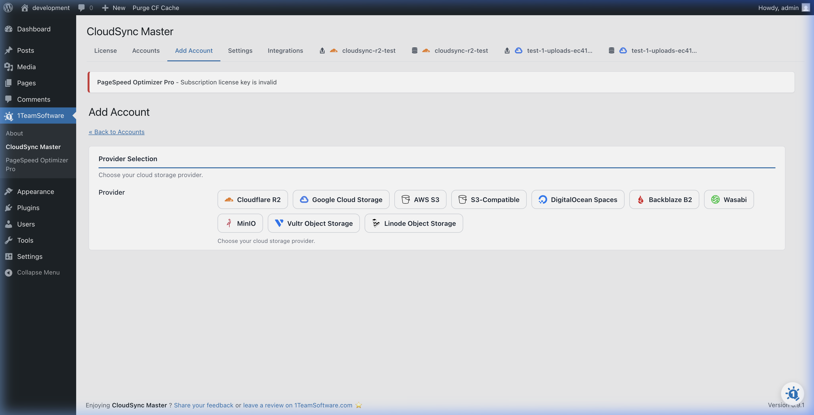
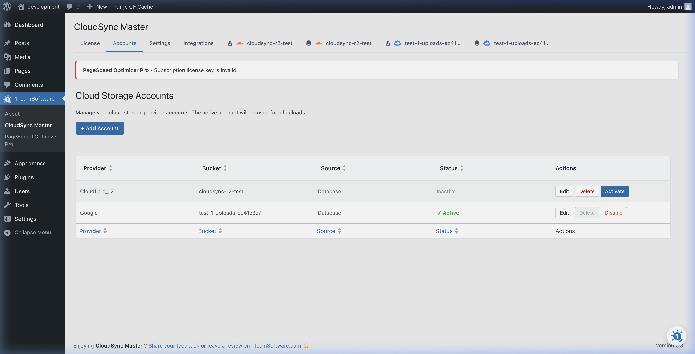

# The Setup Wizard

After activating **WP CloudSync Master**, connect your cloud storage provider to start offloading media.

The Setup Wizard walks you through connecting to Amazon S3, Cloudflare R2, or any of the 10 supported providers.

## Launching the Wizard

1. In your WordPress admin sidebar, click on **CloudSync Master**.
2. Click **+ Add Account** to launch the Setup Wizard.

## Choosing Your Provider

The wizard will display a grid of all supported cloud storage providers:

*   Amazon S3
*   Cloudflare R2
*   Google Cloud Storage
*   DigitalOcean Spaces
*   Backblaze B2
*   Wasabi
*   Vultr
*   Linode
*   MinIO
*   Custom S3-Compatible

Click on the logo of the provider you wish to use. The wizard will then ask for the specific credentials required by that service (for example, Access Keys, Bucket Names, or OAuth tokens for Google Cloud).

> [!TIP]
> For a service with **zero egress fees** (meaning you don't pay data transfer costs when visitors view your images), we highly recommend **Cloudflare R2** or **Wasabi**. 

## After Connecting: Your First 5 Minutes

After connecting a cloud provider, follow these steps to get everything working:

### Quick start checklist

| Step | Action | Where |
|------|--------|-------|
| 1 | **Connect a cloud provider** (you just did this!) | CloudSync Master > Accounts |
| 2 | **Enable "Upload to Cloud"** | CloudSync Master > Settings |
| 3 | **Enable "Serve from Cloud Storage"** | CloudSync Master > Settings |
| 4 | **Upload a test image** to your Media Library | Media > Add New |
| 5 | **Verify it's served from the cloud** — open the image, right-click, and check the URL. It should point to your cloud bucket or custom domain | Media Library |
| 6 | *(Optional)* **Run the Media Scanner** to bulk-upload your existing library | CloudSync Master > Tools *(PRO)* |
| 7 | *(Optional)* **Enable "Delete from Local Server"** to free up disk space after verifying cloud uploads | CloudSync Master > Settings |

> [!IMPORTANT]
> We recommend testing with a single image first (Steps 4-5) before enabling bulk operations. Once you've confirmed the URL rewrites correctly, you can confidently run the Media Scanner on your entire library.

*[CloudSync Master PRO](https://1teamsoftware.com/product/wp-cloudsync-master-pro/) adds OAuth one-click setup for Cloudflare R2 and Google Cloud.*

[🏠 Home](../README.md) | [◀ Previous](installation.md) | [Next ▶](../02-cloud-providers/amazon-s3.md)