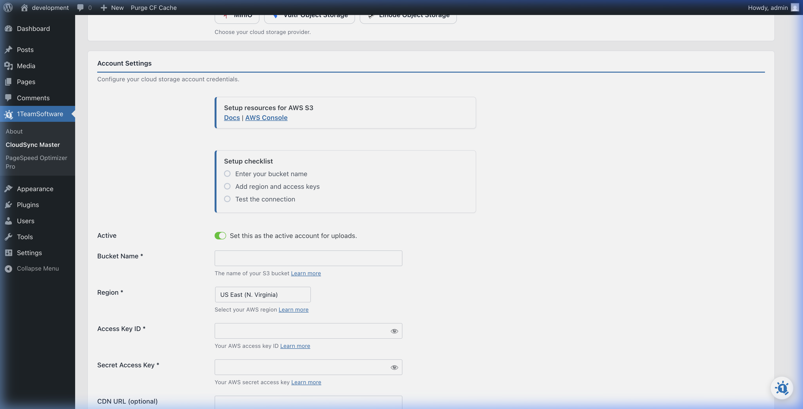

# Connecting to Amazon S3

Amazon S3 (Simple Storage Service) is a reliable option for offloading your WordPress media, with high durability and global availability.

> [!NOTE]
> Amazon S3 uses **Access Keys** for authentication. This method works in both the **Free** and **PRO** versions of CloudSync Master.

## What You'll Need

Before configuring CloudSync Master, you need to gather the following from your AWS account:

| Credential | Where to Find It |
|---|---|
| **Access Key ID** | AWS Console → IAM → Users → Your User → Security Credentials tab |
| **Secret Access Key** | Shown **only once** when you create the Access Key — save it! |
| **Bucket Name** | AWS Console → S3 → Your Bucket |
| **Region** | The AWS region your bucket is in (e.g., `us-east-1`, `eu-west-1`) |

## Step 1: Create an S3 Bucket (if you don't have one)

1. Log in to the [AWS Management Console](https://console.aws.amazon.com/).
2. Navigate to **S3** (search "S3" in the top search bar).
3. Click **Create Bucket**.
4. Enter a **Bucket Name** (e.g., `my-wordpress-media`). Bucket names must be globally unique.
5. Choose a **Region** close to your website visitors for best performance.
6. Leave the default settings (Block Public Access is fine — CloudSync Master handles URL rewriting).
7. Click **Create Bucket**.

## Step 2: Create an IAM User with Access Keys

1. In the AWS Console, navigate to **IAM** (search "IAM" in the top bar).
2. Click **Users** in the left sidebar, then click **Create User**.
3. Enter a username (e.g., `wordpress-cloudsync`) and click **Next**.
4. Select **Attach policies directly** and search for **AmazonS3FullAccess**. Check the box next to it.
   * *For tighter security, you can create a custom policy that only allows access to your specific bucket — see the "Security Best Practices" section below.*
5. Click **Next**, then **Create User**.
6. Click on the new user, go to the **Security Credentials** tab.
7. Under **Access keys**, click **Create access key**.
8. Select **Third-party service** as the use case, check the confirmation box, and click **Next**.
9. Click **Create access key**.
10. **Copy both the Access Key ID and the Secret Access Key immediately.** The Secret Access Key will only be shown once!

> [!CAUTION]
> If you lose the Secret Access Key, you'll need to create a new one. Store both keys in a secure location (e.g., a password manager).

## Step 3: Configure CloudSync Master

1. In your WordPress admin, go to **CloudSync Master > Accounts**.
2. Click **+ Add Account**.
3. Click on the **Amazon S3** logo.
4. Fill in the form:



   * **Account Name:** A friendly label (e.g., "My S3 Bucket").
   * **Bucket Name:** The exact name of your S3 bucket.
   * **Region:** Select the AWS region where your bucket was created.
   * **Access Key ID:** Paste the Access Key ID from Step 2.
   * **Secret Access Key:** Paste the Secret Access Key from Step 2.

5. Click **Test Connection** to verify your credentials.
6. If the test passes, click **Save**.

Your Amazon S3 account is now connected! Head to [General Settings](../03-core-configuration/general-settings.md) to enable cloud uploads.

## Security Best Practices

For production use, we recommend creating a custom IAM policy instead of using `AmazonS3FullAccess`. Here's a minimal policy that gives CloudSync Master exactly the permissions it needs:

```json
{
    "Version": "2012-10-17",
    "Statement": [
        {
            "Effect": "Allow",
            "Action": [
                "s3:PutObject",
                "s3:GetObject",
                "s3:DeleteObject",
                "s3:ListBucket",
                "s3:GetBucketLocation"
            ],
            "Resource": [
                "arn:aws:s3:::YOUR-BUCKET-NAME",
                "arn:aws:s3:::YOUR-BUCKET-NAME/*"
            ]
        }
    ]
}
```

Replace `YOUR-BUCKET-NAME` with your actual bucket name.

---
*[CloudSync Master PRO](https://1teamsoftware.com/product/wp-cloudsync-master-pro/) adds unlimited S3 offloading with no per-item quotas.*

[🏠 Home](../README.md) | [◀ Previous](../01-getting-started/setup-wizard.md) | [Next ▶](cloudflare-r2.md)