# Connecting to Cloudflare R2

Cloudflare R2 offers S3-compatible cloud storage with **zero egress fees**. You pay nothing for bandwidth when visitors load your images, which can save significant money compared to S3 or GCS.

CloudSync Master supports **two ways** to connect to Cloudflare R2:

| Method | Version | Ease | Best For |
|---|---|---|---|
| **Quick Setup** | PRO only | Easiest — guided workflow | Users who want the fastest path |
| **Access Key** | Free + PRO | Manual setup | Free users, or advanced configurations |

---

## Method 1: Quick Setup (PRO Only)

Quick Setup is the fastest way to connect. It walks you through the entire process with a built-in checklist and creates the API token for you directly from WordPress — no need to pre-create anything on Cloudflare.

### Step 1: Configure Quick Setup in CloudSync Master

1. In your WordPress admin, go to **CloudSync Master > Accounts**.
2. Click **+ Add Account**.
3. Click on the **Cloudflare R2** logo.
4. Make sure **Quick Setup** is selected (it's the default in PRO).

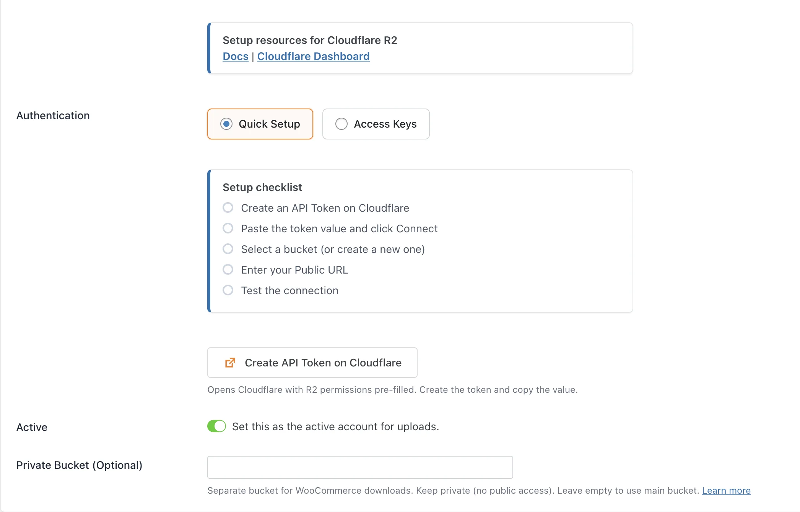

5. Click the **"Create API Token on Cloudflare"** button. A dialog will appear with instructions.

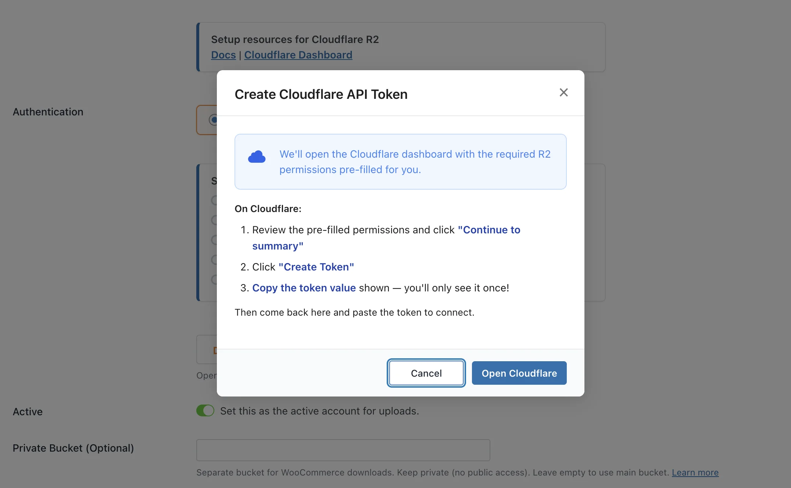

6. Click **"Open Cloudflare"**. A new browser tab will open to Cloudflare's API Token creation page with the required R2 permissions pre-filled.

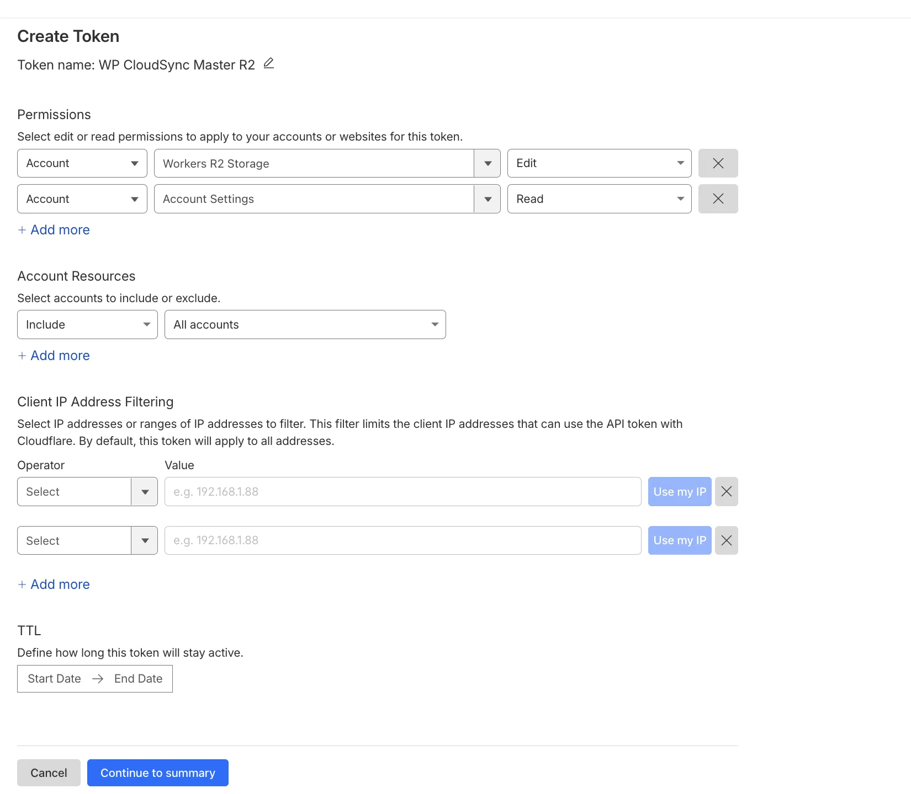

7. Review the pre-filled permissions and click **"Continue to summary"**.

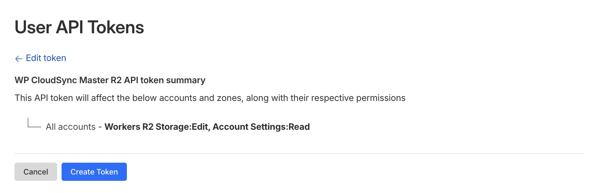

8. Review the token summary and click **"Create Token"**.

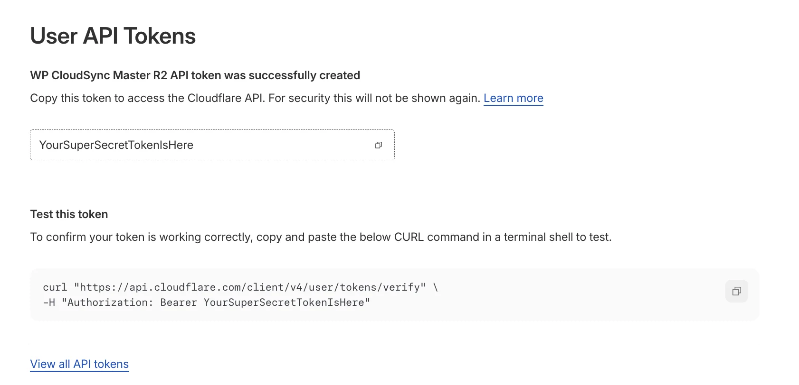

9. **Copy the generated token** (shown only once!) and go back to CloudSync Master. Paste the token and click **Connect**.

### Step 2: Choose or Create a Bucket

Once connected, CloudSync Master will load your R2 buckets automatically. For new buckets, the `r2.dev` public development URL will be pre-filled. If you already have a bucket with a custom public URL configured, it will be preloaded automatically.

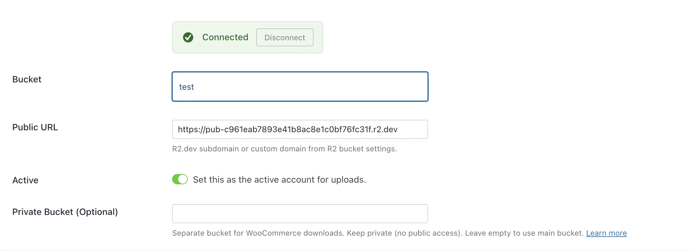

1. In the **Bucket** dropdown, select an existing bucket or type a new name to create one.

2. Enter a **Public URL** (This is **required**):
   * CloudSync Master needs a public-facing URL to construct links for your media files.
   * See the **"Setting Up a Public URL (Required)"** section at the bottom of this page for detailed instructions on getting either an `r2.dev` URL or configuring a custom domain.
   * Copy the public URL and paste it into the **Public URL** field.

3. Click **Test Connection**, then **Save**.

> [!TIP]
> We strongly recommend connecting a custom domain instead of using the default `*.r2.dev` URL. A custom domain activates Cloudflare's full CDN, giving you global edge caching and much faster load times.

---

## Method 2: Access Key (Free + PRO)

This method works in both the Free and PRO versions. You manually create API credentials in the Cloudflare dashboard and enter them into CloudSync Master.

### What You'll Need

| Credential | Where to Find It |
|---|---|
| **Account ID** | [R2 → Overview](https://dash.cloudflare.com/?to=/:account/r2/overview) → "Account Details" section on the right |
| **Bucket Name** | [R2 → Overview](https://dash.cloudflare.com/?to=/:account/r2/overview) → your bucket name in the buckets list |
| **Access Key ID** | [R2 → Overview](https://dash.cloudflare.com/?to=/:account/r2/overview) → Manage API Tokens → Create Account API Token |
| **Secret Access Key** | Shown **only once** when you create the Account API Token — save it! |

### Step 1: Create an R2 Bucket (if you don't have one)

1. Log in to the [Cloudflare Dashboard](https://dash.cloudflare.com/).
2. In the left sidebar, click **R2 Object Storage** (or go directly to [R2 Overview](https://dash.cloudflare.com/?to=/:account/r2/overview)).
3. Click **Create Bucket**.
4. Enter a bucket name (e.g., `wordpress-media`) and choose a location hint closest to your visitors.
5. Click **Create Bucket**.

### Step 2: Get “Access Key ID” and “Secret Access Key”

Now we need to create an R2 API Token to get the Access Key ID and Secret Access Key.

1. Go to [R2 → Overview](https://dash.cloudflare.com/?to=/:account/r2/overview).
2. On the right side, in the **"Account Details"** section, click **"Manage"** next to **"API Tokens"**.

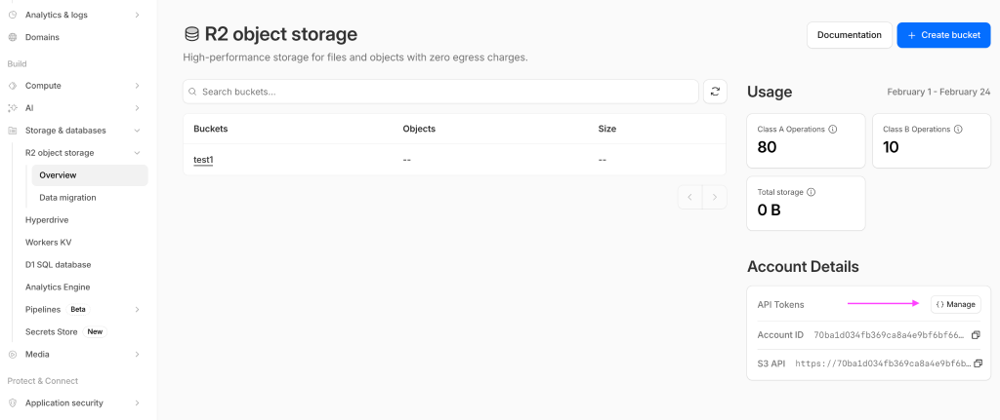

3. On the R2 API Tokens page, click the **"Create Account API Token"** button (recommended over "Create User API Token").

4. On the "Create Account API Token" page:
   * Enter a **Token name** (e.g., "CloudSync Master").
   * Under **Permissions**, select **"Object Read & Write"**.

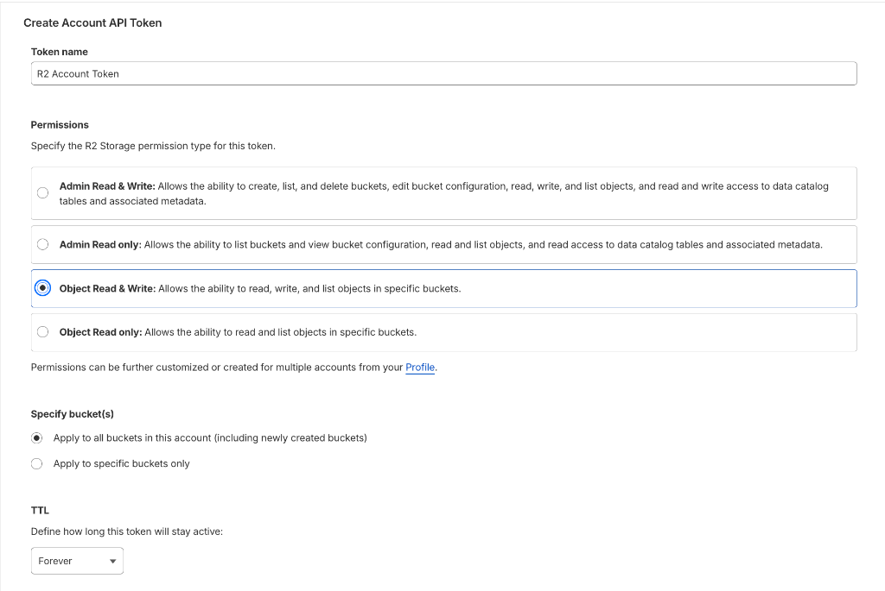

   * Under **Specify bucket(s)**, choose **"Apply to all buckets in this account"** or select your specific bucket.
   * Leave **TTL** as default (no expiration) unless you want the token to expire.
5. Click the **"Create Account API Token"** button at the bottom.

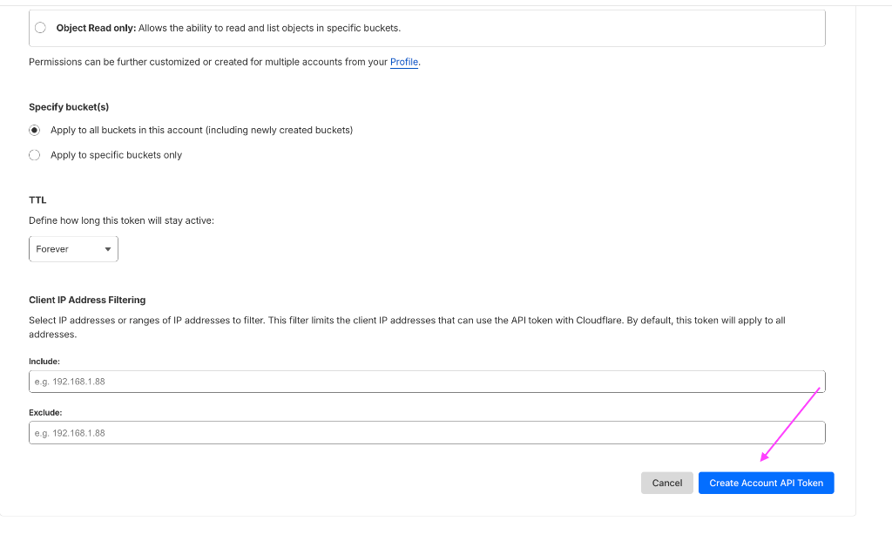

6. You will see a confirmation page with three values:
   * **Token value** — not needed for Access Key setup (used only for Quick Setup).
   * **Access Key ID** — copy this for the CloudSync Master "Access Key ID" field.
   * **Secret Access Key** — copy this for the CloudSync Master "Secret Access Key" field.

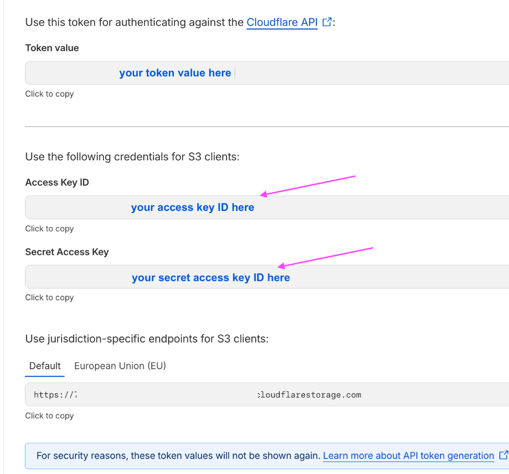

7. **Save all three values somewhere safe** (e.g., a password manager). The Secret Access Key and Token value will **not be shown again**.

> [!CAUTION]
> If you lose the Secret Access Key, you'll need to delete the token and create a new one. Save both the Access Key ID and Secret Access Key in a password manager.

### Step 3: Configure CloudSync Master

1. In your WordPress admin, go to **CloudSync Master > Accounts**.
2. Click **+ Add Account**.
3. Click on the **Cloudflare R2** logo.
4. Switch the **Authentication Method** to **"Access Keys"**. (Free users will see this mode by default.)

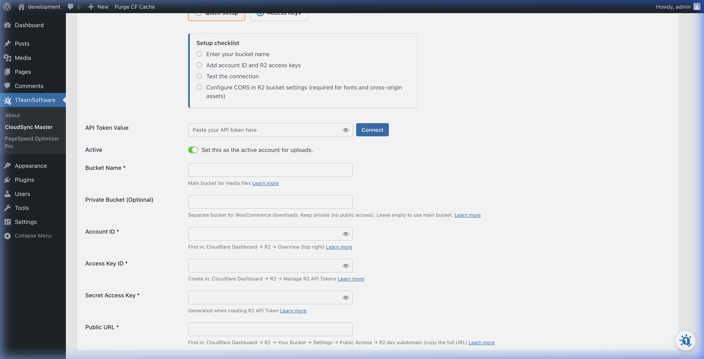

5. Fill in the form:
   * **Account Name:** A friendly label (e.g., "My R2 Storage").
   * **Account ID:** Your Cloudflare Account ID (from "Account Details" on the [R2 Overview](https://dash.cloudflare.com/?to=/:account/r2/overview) page).
   * **Bucket Name:** The exact name of the R2 bucket you created.
   * **Access Key ID:** From the API token you created in Step 2.
   * **Secret Access Key:** From the API token you created in Step 2.
   * **Public URL:** The public-facing URL of your bucket. This is **required**. (See "Setting Up a Public URL" below).

6. Click **Test Connection** to verify your credentials.
7. If the test passes, click **Save**.

Your Cloudflare R2 account is now connected! Head to [General Settings](../03-core-configuration/general-settings.md) to enable cloud uploads.

### Setting Up a Public URL (Required)

Unlike some providers, **Cloudflare R2 requires a public URL to be explicitly configured** so that CloudSync Master can construct the correct links for your media files. 

Now, we need to get the Public URL information.

1. Go to [R2 → Overview](https://dash.cloudflare.com/?to=/:account/r2/overview), click on your bucket name, then click the **Settings** tab.

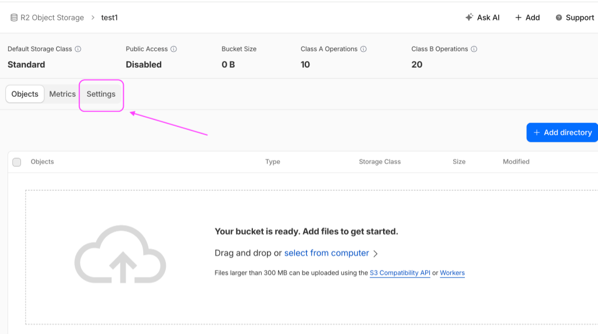

2. Scroll down until you see **Public Development URL**. 

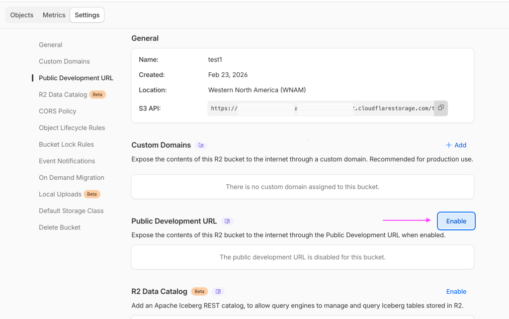

3. You have two options here:
   * **Option A: Public Development URL (Free):** If you don't have a custom domain, click **"Enable"** for the Public Development URL.
   * **Option B: Custom Domain (Recommended for Production):** Click "Add" under the Custom Domains section to configure your own domain (e.g., `media.yourdomain.com`).

#### Using the Public Development URL
If you clicked **"Enable"**:

1. A window will pop up asking for confirmation. Type “allow” in the box, and click **"Allow"** to proceed.

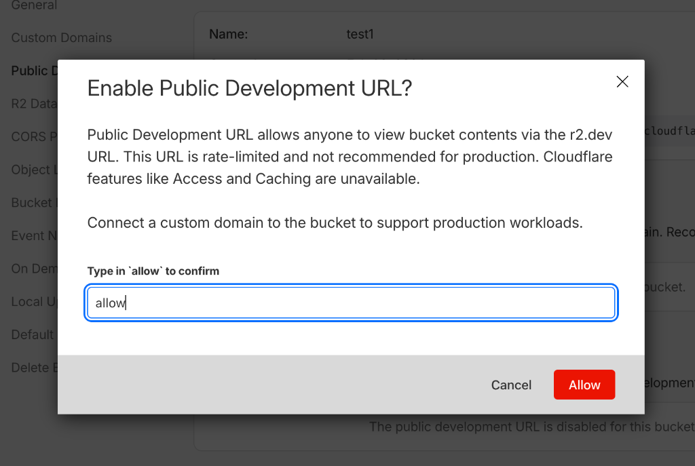

2. It will direct you back to the settings page. 
3. You will see the **Public Development URL** appear now. Please take note of it (copy the URL).

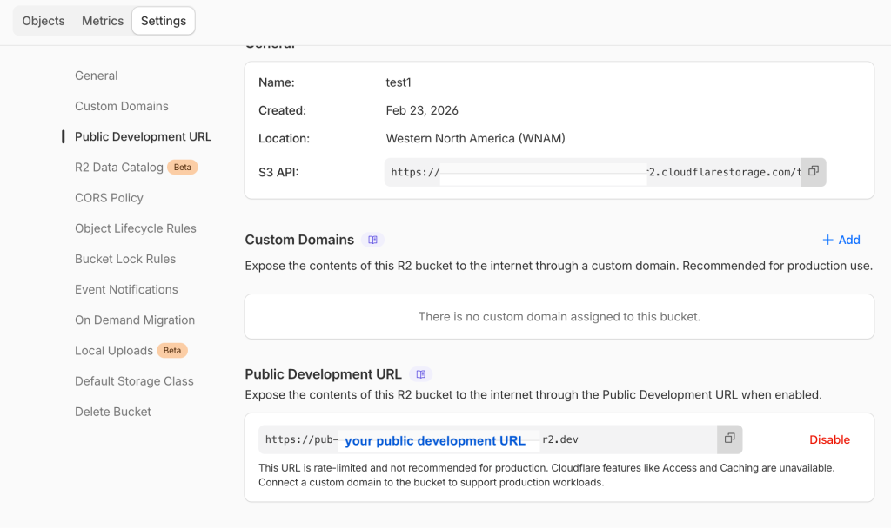

4. Go back to CloudSync Master and paste this full URL into the **Public URL** field in your Cloudflare R2 account settings.

---
*[CloudSync Master PRO](https://1teamsoftware.com/product/wp-cloudsync-master-pro/) adds Quick Setup for R2 with one-click API token creation.*

[🏠 Home](../README.md) | [◀ Previous](amazon-s3.md) | [Next ▶](google-cloud.md)