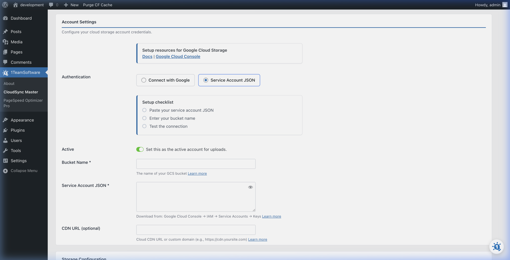

# Connecting to Google Cloud Storage

Google Cloud Storage (GCS) offers global CDN integration and fine-grained access controls. It works well for WordPress sites already in the Google Cloud ecosystem or those needing multi-regional redundancy.

CloudSync Master supports **two ways** to connect to Google Cloud Storage:

| Method | Version | Ease | Best For |
|---|---|---|---|
| **One-Click OAuth** | PRO only | Easiest — no JSON key needed | Users who want instant setup |
| **Service Account Key** | Free + PRO | Manual — upload a JSON key | Free users, or shared/controlled environments |

---

## Method 1: One-Click OAuth (PRO Only)

OAuth is the fastest way to connect. You authenticate with your Google account and grant CloudSync Master access to your Storage buckets — no key files to create or manage.

### What You'll Need

* A Google account with access to your Google Cloud project
* At least one GCS bucket already created (see Step 1 below)

### Step 1: Create a GCS Bucket (if you don't have one)

1. Go to the [Google Cloud Console](https://console.cloud.google.com/).
2. Select or create a **Project** using the project selector at the top of the page.
3. In the left sidebar, navigate to **Cloud Storage > Buckets**.
4. Click **Create** at the top.
5. Enter a **Bucket Name** (must be globally unique, e.g., `my-wordpress-media-2024`).
6. Choose a **Location Type**:
   * **Region** — lowest cost, data in a single region.
   * **Multi-region** — higher availability across geographic areas.
7. Leave the other defaults and click **Create**.

### Step 2: Connect Using OAuth

1. In your WordPress admin, go to **CloudSync Master > Accounts**.
2. Click **+ Add Account**.
3. Click on the **Google Cloud Storage** logo.
4. Select the **OAuth** authentication method (default in PRO).

5. Click the **"Sign in with Google"** button.
6. A Google login window will appear. Sign in with the Google account that has access to your GCS project.
7. Review the permission request and click **Allow**.
8. You'll be redirected back to WordPress — your buckets will auto-populate.
9. Select the bucket you want to use from the dropdown.
10. Click **Test Connection**, then **Save**.

> [!TIP]
> OAuth tokens are automatically refreshed by CloudSync Master, so you don't need to worry about expiring credentials. If you ever want to disconnect, simply revoke access from your [Google Account permissions page](https://myaccount.google.com/permissions).

---

## Method 2: Service Account Key (Free + PRO)

This method uses a JSON key file downloaded from the Google Cloud Console. It works in both the Free and PRO versions and is ideal for environments where you want a dedicated service account with specific permissions.

### What You'll Need

| Credential | Where to Find It |
|---|---|
| **Service Account JSON Key** | Created via Google Cloud Console → IAM & Admin → Service Accounts |
| **Bucket Name** | Google Cloud Console → Cloud Storage → Buckets |

### Step 1: Create a GCS Bucket (if you don't have one)

Follow the same steps as Method 1, Step 1 above.

### Step 2: Create a Service Account

1. Go to the [Google Cloud Console](https://console.cloud.google.com/).
2. Select your **Project** using the selector at the top.
3. In the left sidebar, navigate to **IAM & Admin > Service Accounts**.
4. Click **Create Service Account** at the top.
5. Fill in the details:
   * **Name:** e.g., `wordpress-cloudsync`
   * **Description:** e.g., `Service account for WP CloudSync Master plugin`
6. Click **Create and Continue**.
7. Under **Grant this service account access to project**, add the role:
   * Search for and select **Storage Admin** (or **Storage Object Admin** for minimal permissions).
8. Click **Continue**, then **Done**.

### Step 3: Download the JSON Key

1. On the **Service Accounts** page, find the account you just created.
2. Click the three-dot menu (⋮) on the right, then select **Manage Keys**.
3. Click **Add Key > Create New Key**.
4. Select **JSON** format and click **Create**.
5. The JSON file will automatically download to your computer. **Keep this file safe!**

> [!CAUTION]
> This JSON key grants access to your cloud storage. Never share it publicly or commit it to version control. Store it securely.

### Step 4: Configure CloudSync Master

1. In your WordPress admin, go to **CloudSync Master > Accounts**.
2. Click **+ Add Account**.
3. Click on the **Google Cloud Storage** logo.
4. Switch the **Authentication Method** to **"Service Account Key"**. (Free users will see this mode by default.)
5. Fill in the form:
   * **Account Name:** A friendly label (e.g., "My GCS Bucket").
   * **Bucket Name:** The exact name of the bucket you created.
   * **Service Account JSON Key:** Click **Choose File** and upload the JSON file you downloaded, or paste the contents directly.
6. Click **Test Connection** to verify your credentials.
7. If the test passes, click **Save**.

Your Google Cloud Storage account is now connected! Head to [General Settings](../03-core-configuration/general-settings.md) to enable cloud uploads.

---
*[CloudSync Master PRO](https://1teamsoftware.com/product/wp-cloudsync-master-pro/) adds one-click OAuth for Google Cloud, so you skip the JSON key setup entirely.*

[🏠 Home](../README.md) | [◀ Previous](cloudflare-r2.md) | [Next ▶](../03-core-configuration/general-settings.md)