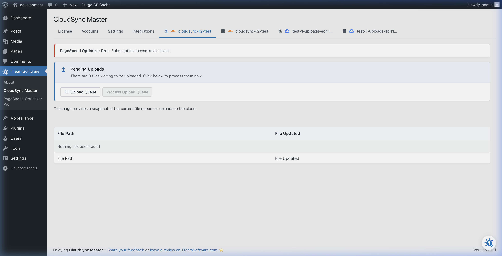

# Background Sync & Upload Queue

When you upload a large number of images to WordPress, WP CloudSync Master processes them in the background via the **Upload Queue**.

The plugin uses REST APIs to asynchronously validate and push items to the cloud. You can leave the page and it will keep working.

## Real-Time Visibility

Unlike other plugins that process uploads invisibly as a "black box," CloudSync Master gives you complete transparency.

1. Navigate to **CloudSync Master > Queue**.
2. You will see a dashboard showing the real-time status of your uploads.

## Queue Controls

From the Queue tab, you have full control over the syncing process:

*   **Pause & Resume:** Temporarily halt uploads if your server needs a breather.
*   **Cancel All:** Stop the current batch of syncing completely.
*   **Retry Failed Items:** If a file fails to upload (due to a network hiccup or temporary cloud provider outage), simply click retry.

## Optimizing the Queue

The speed of the queue is largely determined by your **Concurrency** setting.

*   By default, the plugin uploads **5** items simultaneously. 
*   If you have **CloudSync Master PRO**, you can increase this to **20** concurrent uploads in the General Settings tab.

> [!TIP]
> **What affects queue performance?** Large video files, extreme concurrency set on low-tier shared hosting, and image optimizers running simultaneously can slow down processing. If your site becomes sluggish during a massive bulk upload, lower the concurrency slider in Settings!

---
*[CloudSync Master PRO](https://1teamsoftware.com/product/wp-cloudsync-master-pro/) supports up to 20 concurrent background uploads.*

[🏠 Home](../README.md) | [◀ Previous](general-settings.md) | [Next ▶](objects-browser.md)