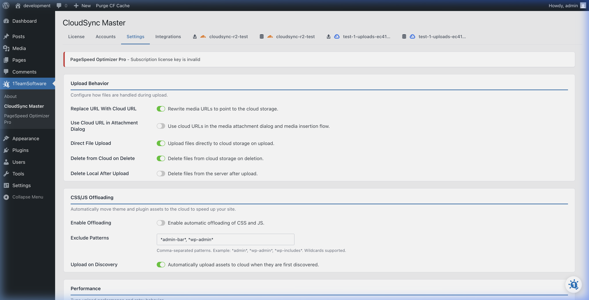

# General Settings & Configuration

The **Settings** tab controls how your media is offloaded, what happens when files are deleted, and how your WordPress URLs are rewritten to serve from the cloud.

## Core Toggles

These master switches dictate the plugin's primary behavior:

### Upload to Cloud
* **What it does:** When enabled, any new file uploaded to the WordPress Media Library is automatically pushed to your active cloud storage provider.
* **How it works:** When you upload an image (e.g., via the Media Library or a post editor), WP CloudSync Master hooks into the background process. It instantly validates the file, contacts your cloud provider's API, and uploads both the original file and all generated thumbnail sizes.
* **Recommendation:** Keep this **ON** for automated offloading.

### Delete from Local Server
* **What it does:** Once a file is successfully verified on the cloud, this setting safely deletes the file from your local web server's `wp-content/uploads` folder.
* **How it works:** To ensure zero physical data loss, the plugin first waits for a successful response from your cloud provider confirming the upload. Only after the file is confirmed to exist in the cloud will it be removed from your local disk.
* **Why use it:** This is the primary way to save disk space on your hosting plan.

### Delete from Cloud Storage
* **What it does:** If you delete an image from your WordPress Media Library, this toggle ensures it is also permanently deleted from your cloud bucket.
* **How it works:** It intercepts the WordPress media deletion hook. Before WordPress removes the database record, CloudSync Master sends a delete request to your cloud provider. This keeps your local and cloud storage perfectly synchronized.
* **Why use it:** It keeps your cloud storage clean and prevents you from paying for orphaned files you no longer need.

### Serve from Cloud Storage (URL Rewriting)
* **What it does:** This activates the core performance feature of the plugin. It automatically rewrites the URLs of your media files across your entire site (posts, pages, products) to serve them directly from your active cloud bucket or custom CDN domain.
* **How it works:** The plugin dynamically filters content as it is rendered to the visitor. If an image is stored on your local server, it leaves the URL alone. If the database indicates the image was offloaded to the cloud, it swaps `https://yourdomain.com/wp-content/...` with `https://cdn.yourdomain.com/...` on the fly.
* **Recommendation:** Keep this **ON** unless you are temporarily troubleshooting or have another CDN plugin handling rewriting.

## The Media Library Integration

Once you have configured the settings, you can head over to your WordPress **Media Library** to see WP CloudSync Master in action.

**Switch to List View:**
To see cloud sync statuses, ensure your Media Library is set to the **List View** (by clicking the list icon in the top left corner). 

You will notice a new column added by WP CloudSync Master. This column indicates:
* **The Provider:** Which cloud provider the file was offloaded to (e.g., Amazon S3, Google Cloud, Cloudflare R2).
* **The Bucket:** The specific bucket where the file resides.
* **Access Type:** Whether the file is Public or Private (especially relevant for WooCommerce digital downloads).

This gives you a clear bird's-eye view of your entire media library and what has been successfully offloaded to the cloud.

## Advanced Settings & Concurrency

WP CloudSync Master supports concurrent async uploads via REST APIs.

### Concurrency (PRO)
The "Concurrent Uploads" slider dictates how many files are uploaded to the cloud simultaneously. 
* The Free version allows up to 5 concurrent uploads.
* **The PRO version unlocks up to 20 concurrent uploads.**
* If you have a capable server and a large batch of images to offload (using the Media Scanner), increasing the concurrency slider will reduce upload times.

### Custom Domain (CDN)
If you've connected your bucket to a CDN (like Cloudflare, KeyCDN, or BunnyCDN), enter your custom domain here (e.g., `https://cdn.mywebsite.com`). Whenever "Serve from Cloud Storage" is active, WP CloudSync Master will use this domain instead of the default generic URLs provided by Google Cloud or Amazon S3.

---
*[CloudSync Master PRO](https://1teamsoftware.com/product/wp-cloudsync-master-pro/) raises the concurrency limit to 20 parallel uploads.*

[🏠 Home](../README.md) | [◀ Previous](../02-cloud-providers/google-cloud.md) | [Next ▶](background-sync.md)