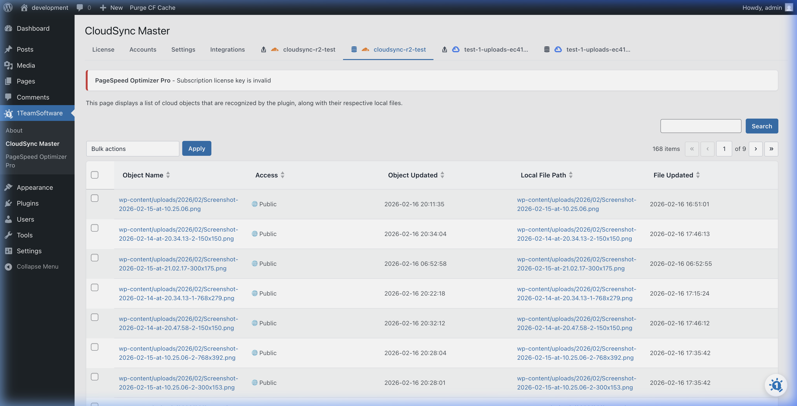

# The Objects Browser

Trying to figure out exactly what files made it to your cloud storage bucket? You don't need to log in to your Amazon AWS or Cloudflare dashboard. We built an **Objects Browser** directly into WordPress.

## Finding Your Files

1. Go to **CloudSync Master > Objects**.
2. Select your provider/bucket from the dropdown menu.

You will see a clean, sortable interface displaying every object currently stored in the selected cloud bucket.

### Bulk Actions

The Objects Browser is not just for viewing; it's a powerful management tool. Use the checkboxes next to items to:

*   **Delete from Cloud:** Instantly remove files from your cloud storage.
*   **Import to WordPress (PRO):** Found a file in your bucket that isn't attached to your WordPress Media Library? Select it, click Import, and CloudSync Master will download the file, parse the metadata, and register it in your WordPress admin.
*   **Change Access Types:** Quickly flip an object's permissions from Public to Private (useful if you are selling digital products and don't want the file to be broadly accessible).

### Search and Filtering

If you have thousands of images (or even just deeply nested WordPress folders like `/2026/02/`), you can use the search bar to locate specific filenames or extensions within your bucket. 

> [!TIP]
> The Objects Browser is highly secure. Any changes made here are performed using the API credentials you configured in the Accounts tab.

---
*[CloudSync Master PRO](https://1teamsoftware.com/product/wp-cloudsync-master-pro/) adds the Import to WordPress feature in the Objects Browser.*

[🏠 Home](../README.md) | [◀ Previous](background-sync.md) | [Next ▶](../04-features-and-tools/offloading-media.md)