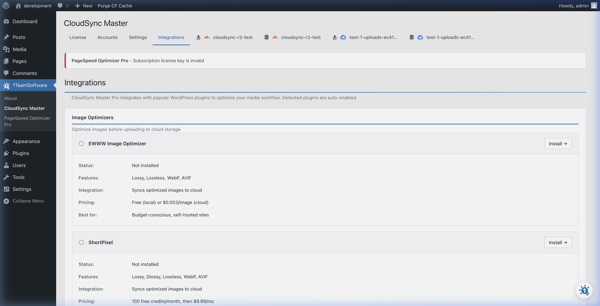

# Integrations: Image Optimizers

Offloading images to the cloud saves disk space, but if you're still serving unoptimized 5MB originals, your PageSpeed scores won't improve much.

You want to **optimize your images *before* they hit the cloud.** CloudSync Master PRO integrates with popular image optimization plugins so your cloud bucket gets the compressed, next-gen versions.

## Supported Optimizers

The plugin natively integrates with:
*   **ShortPixel**
*   **Imagify**
*   **EWWW Image Optimizer**
*   **Smush / Smush Pro**
*   **TinyPNG**

## How the Integration Works

Normally, when you activate an image optimizer and a cloud storage plugin simultaneously, a race condition occurs:

1. You upload an image to WordPress.
2. The CloudSync plugin instantly uploads the large original file to the cloud.
3. The Optimizer compresses the local file a few seconds later.
4. Result: Your optimized image is stuck on your server, while your cloud bucket only has the massive original file.

### Our Solution
When you toggle on an optimization integration in the **CloudSync Master > Integrations** tab, we introduce a smart waiting period.

1. You upload an image to WordPress.
2. **CloudSync Master pauses and waits for your Optimizer plugin to finish.**
3. Once the Optimizer signals it's done compressing (and generating WebP/AVIFs), CloudSync Master picks up the result.
4. It uploads the optimized image to your cloud bucket.

## Activating the Integration

1. Go to **CloudSync Master > Integrations**.
2. Locate the "Image Optimizers" section.
3. Toggle the switch next to your preferred optimization plugin (e.g., ShortPixel).
4. Save your changes.

> [!TIP]
> **What about WebP and AVIF?** 
> CloudSync Master PRO supports next-gen image formats. If your optimizer (like Imagify or EWWW) generates a WebP version alongside your JPG, CloudSync Master uploads both to the cloud. The URL rewriting automatically serves the WebP version to browsers that support it.

---
*[CloudSync Master PRO](https://1teamsoftware.com/product/wp-cloudsync-master-pro/) uploads WebP and AVIF versions and auto-serves them to supported browsers.*

[🏠 Home](../README.md) | [◀ Previous](ecommerce.md) | [Next ▶](../06-troubleshooting/common-issues.md)